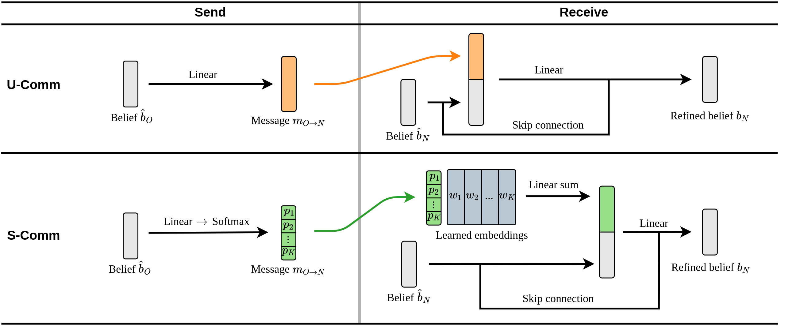
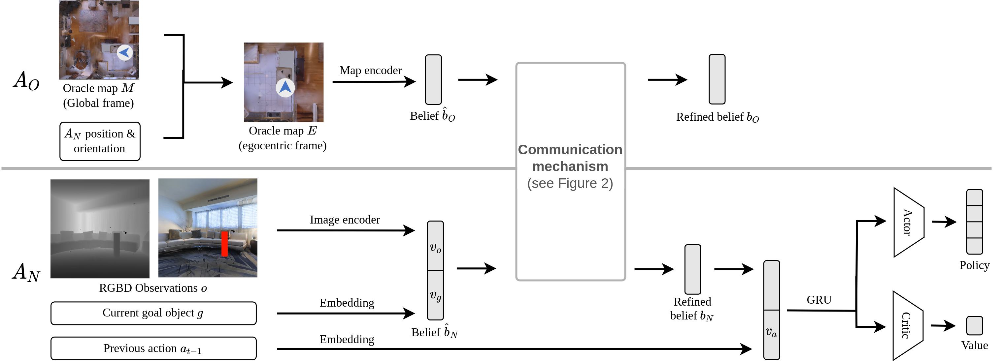

[](https://iccv2021.thecvf.com/home)
[](https://www.python.org/downloads/release/python-360/)
[](https://github.com/facebookresearch/habitat-lab)

# Interpretation of Emergent Communication in Heterogeneous Collaborative Embodied Agents

This is a PyTorch implementation of our ICCV 2021 paper, [Interpretation of Emergent Communication in Heterogeneous Collaborative Embodied Agents]().

Project Webpage: https://shivanshpatel35.github.io/comon/

## CoMON Task
In CoMON, an episode involves two heterogeneous agents -- a disembodied agent with access to oracle top-down map of the environment and an embodied agent which navigates and interacts with the environment. The two agents communicate and collaborate to perform the [MultiON task](https://github.com/saimwani/multion).


## Communication Mechanisms

## Architecture Overview




## Installing dependencies:

This code is tested on python 3.6.10, pytorch v1.4.0 and CUDA V9.1.85.

Install pytorch from https://pytorch.org/ according to your machine configuration.

This code uses older versions of [habitat-sim](https://github.com/facebookresearch/habitat-sim) and [habitat-lab](https://github.com/facebookresearch/habitat-lab). Install them by running the following commands:

#### Installing habitat-sim:

```
git clone https://github.com/facebookresearch/habitat-sim.git
cd habitat-sim 
git checkout ae6ba1cdc772f7a5dedd31cbf9a5b77f6de3ff0f
pip install -r requirements.txt; 
python setup.py install --headless # (for headless machines with GPU)
python setup.py install # (for machines with display attached)
```

#### Installing habitat-lab:
```
git clone --branch stable https://github.com/facebookresearch/habitat-lab.git
cd habitat-lab
git checkout 676e593b953e2f0530f307bc17b6de66cff2e867
pip install -e .
```

For installation issues in habitat, feel free to raise an issue in this repository, or in the corresponding habitat repository.


## Setup
Clone the repository and install the requirements:

```
git clone https://github.com/saimwani/comon
cd comon
pip install -r requirements.txt
```

### Downloading data and checkpoints

To evaluate pre-trained models and train new models, you will need to download the MultiON dataset, including objects inserted into the scenes, and model checkpoints for CoMON. Running `download_data.sh` from the root directory (`CoMON/`) will download the data and extract it to appropriate directories. Note that you are still required to download Matterport3D scenes after you run the script (see section on **Download Matterport3D scenes** below). 

```
bash download_multion_data.sh
```

#### Download multiON dataset

*You do not need to complete this step if you have successfully run the `download_data.sh` script above.*

Run the following to download multiON dataset and cached oracle occupancy maps:
```
mkdir data
cd data
mkdir datasets
cd datasets
wget -O multinav.zip "http://aspis.cmpt.sfu.ca/projects/multion/multinav.zip"
unzip multinav.zip && rm multinav.zip
cd ../
wget -O objects.zip "http://aspis.cmpt.sfu.ca/projects/multion/objects.zip"
unzip objects.zip && rm objects.zip
wget -O default.phys_scene_config.json "http://aspis.cmpt.sfu.ca/projects/multion/default.phys_scene_config.json"
cd ../
mkdir oracle_maps
cd oracle_maps
wget -O map300.pickle "http://aspis.cmpt.sfu.ca/projects/multion/map300.pickle"
cd ../
```

#### Download Matterport3D scenes

The Matterport scene dataset and multiON dataset should be placed in `data` folder under the root directory (`multiON/`) in the following format:

```
CoMON/
  data/
    scene_datasets/
      mp3d/
        1LXtFkjw3qL/
          1LXtFkjw3qL.glb
          1LXtFkjw3qL.navmesh
          ...
    datasets/
      multinav/
        3_ON/
          train/
            ...
          val/
            val.json.gz
        2_ON
          ...
        1_ON
          ...
```				

Download Matterport3D data for Habitat by following the instructions mentioned [here](https://github.com/facebookresearch/habitat-api#data).

## Usage

### Pre-trained models

*You do not need to complete this step if you have successfully run the `download_data.sh` script above.* 

```
mkdir model_checkpoints
``` 
Download a model checkpoint for Unstructured communication (U-Comm) or Structured communication (S-Comm) setup as shown below.

| Agent            | Run                                                                                                  |
|------------------|:----------------------------------------------------------------------------------------------------:|
| U-Comm           |`wget -O model_checkpoints/ckpt.1.pth "http://aspis.cmpt.sfu.ca/projects/comon/model_checkpoints/un_struc/ckpt.1.pth"`|
| S-Comm       |`wget -O model_checkpoints/ckpt.1.pth "http://aspis.cmpt.sfu.ca/projects/comon/model_checkpoints/struc/ckpt.1.pth"`|


### Evaluation

To evaluate a pretrained `S-Comm` agent, run this from the root folder (`CoMON/`):

```
python habitat_baselines/run.py --exp-config habitat_baselines/config/multinav/comon.yaml --comm-type struc --run-type eval
``` 

For `U-Comm` setup, replace `struc` with `un-struc`.


Average evaluation metrics are printed on the console when evaluation ends. Detailed metrics are placed in `tb/eval/metrics` directory. 

### Training

For training an `S-Comm` agent, run this from the root directory: 

```
python habitat_baselines/run.py --exp-config habitat_baselines/config/multinav/comon.yaml --comm-type struc --run-type train
```
For `U-Comm`, replace `struc` with `un-struc`. 


## Citation
> Shivansh Patel*, Saim Wani*, Unnat Jain*, Alexander Schwing, Svetlana Lazebnik, Manolis Savva, Angel X. Chang. Interpretation of Emergent Communication in Heterogeneous Collaborative Embodied Agents In ICCV 2021. [PDF](https://shivanshpatel35.github.io/comon/resources/comon.pdf)

## Bibtex
``` 	
@inproceedings{patel2021interpretation,
  Author = {Shivansh Patel and Saim Wani and Unnat Jain and Alexander Schwing and 
  Svetlana Lazebnik and  Manolis Savva and Angel X. Chang},
  Title = {Interpretation of Emergent Communication 
  in Heterogeneous Collaborative Embodied Agents},
  Booktitle = {ICCV},
  Year = {2021}
  }
```

## Acknowledgements
This repository is built upon [Habitat Lab](https://github.com/facebookresearch/habitat-lab).
